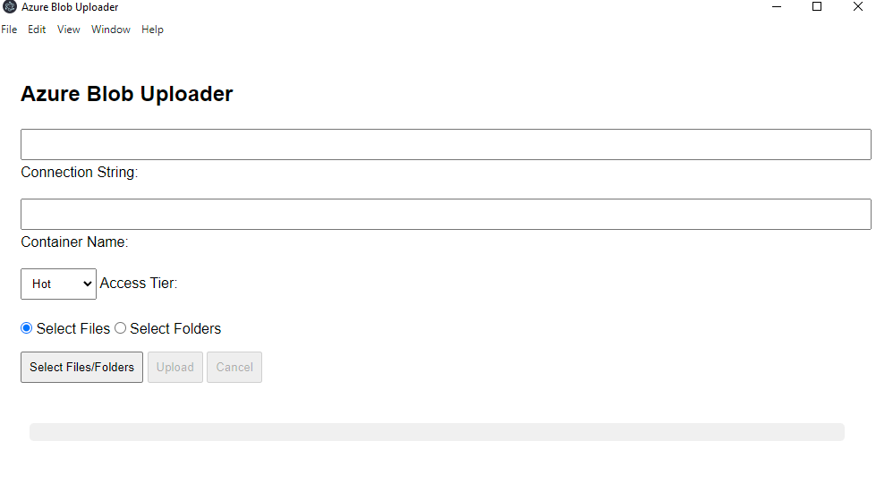

# Blob Uploader App for Azure Blob Storage

This is a simple Python application that allows you to upload files to Azure Blob Storage. 
It uses TypeScript for the interface and leverages Python for the upload process.



# How to use

## Running with Docker

Run docker compose to build the images:

```bash
docker-compose build --no-cache && docker-compose up
```

The app will be available at `http://127.0.0.1:5000`


## Running without Docker, as a local app

Run the following commands:

```bash
npm install
npm run build
npm start
```

Run the following commands:

```bash
npm run pack
```

Run the installer located in the dist folder

The app will be installed in your Windows machine

- To use the app:

First, you need the `connection string` of your `Azure Storage account`, you
can get it from the `Azure Portal` by heading to your storage account and clicking on the `Access Keys` section.

Then, you need to paste the `connection string` in the `"Connection String"` field.

Second, you need to insert the `container name` where you want to upload the files.
>The container must be created before uploading files.

Then, choose if you want to upload files or folders by selecting the appropriate option.

Finally,
you can select the files/folder you want to upload by clicking on the `"Select Files/Folders"`
button.

> By selecting a folder, all files inside the folder will be uploaded.
> By selecting files, only the selected files will be uploaded.

Also, you can choose `Access Tier` for the uploaded files, 
and the files will be uploaded with the selected Access Tier.

The available options are:
- Hot
- Cool
- Cold
- Archive

> The default Access Tier is `Hot`

Finally, click on the `"Upload"` button to start the upload process.

## Name Hierarchies

The app will respect naming hierarchy.

For example:
if you select a folder named `folder1` 
that contains a folder named `folder2` that contains a file named`file1.txt`, 
the file will be uploaded to the container with the following path:
`folder1/folder2/file1.txt`.

> Name hierarchy will only be respected for folders when running the app on docker.
> To respect name hierarchy when running the app on docker, use the Target Folder (for individual files):
> e.g. `uploads/`


## How it works

The app uses the Azure SDK for Python to upload files to Azure Blob Storage.
It uses typescript to create the interface and Python to handle the upload process.
It handles threads according to the number of files to increase performance.

## Performance

The cpu and ram usage is low, the app is able to handle multiple files at the same time without any issues.
> Notice that disk and network usage will be high during the upload process for obvious reasons.
